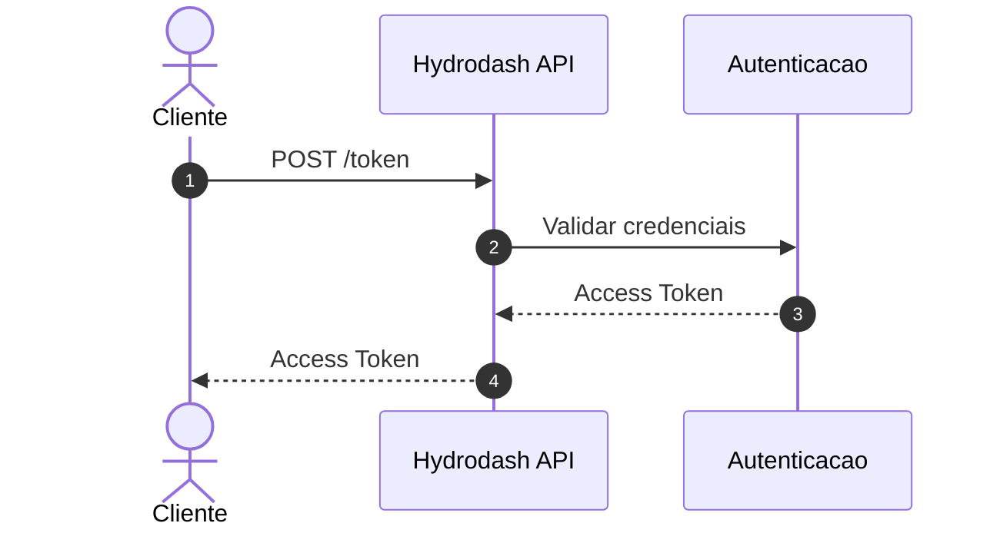
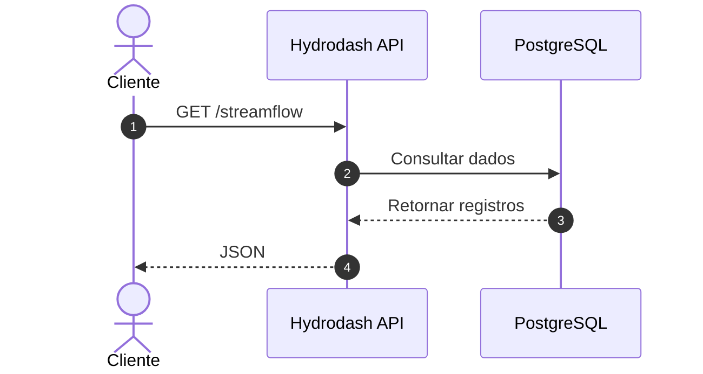

# Documentação Técnica da Hydrodash API
*Versão da Documentação: 1.0.0*  
*Data de Atualização: 27 de Agosto de 2026*  

---

## 1. Visão Geral

A **Hydrodash API** é uma interface de programação de aplicação (API) no padrão RESTful desenvolvida para fornecer acesso programático a dados hidrológicos, climáticos e de previsão simulados de bacias hidrográficas brasileiras. A API é alimentada por modelos baseados em aprendizado de máquina (como redes LSTM para vazão) combinados com previsões climáticas numéricas.

### Finalidade e Aplicações
Os dados disponibilizados destinam-se a dar suporte a tomadas de decisão nos setores de recursos hídricos, energia hidrelétrica, saneamento básico, agricultura de precisão e gestão de riscos ambientais (como cheias e estiagens). Os endpoints da API retornam dados no formato padrão JSON, permitindo integração direta com diversas ferramentas de análise de dados e inteligência de negócios, tais como:
* **Business Intelligence (BI)**: Power BI, Tableau, Qlik e Excel.
* **Linguagens de Programação**: Python, R, Julia e MATLAB.
* **Sistemas de Informação Geográfica (SIG)**: QGIS e ArcGIS.

---

## 2. Arquitetura da API

A arquitetura da Hydrodash API segue o padrão REST sobre HTTP com segurança baseada em token Bearer. A API se comunica diretamente com um banco de dados PostgreSQL hospedado no Railway, onde as rodadas dos modelos climáticos e hidrológicos são salvas diariamente por meio de pipelines de dados automatizados.

### Fluxo de autenticação

A autenticação da Hydrodash API é realizada por meio do endpoint `/token`.

O cliente envia suas credenciais para a API, que realiza a validação. Quando as
credenciais são válidas, um **Access Token** é retornado ao cliente.

Esse token deve ser utilizado nas requisições subsequentes aos endpoints
protegidos da API, por meio do cabeçalho `Authorization`, no formato:

```text
Authorization: Bearer <TOKEN>
```

O fluxo de autenticação é representado abaixo:



---

### Fluxo de consulta de dados

Após obter um **Access Token** válido, o cliente pode realizar consultas aos
endpoints protegidos da Hydrodash API.

No exemplo abaixo, o cliente solicita dados de vazão por meio do endpoint
`/streamflow`. A API processa a requisição autenticada, consulta os dados
correspondentes no banco de dados PostgreSQL e retorna os registros ao cliente
em formato JSON.

O fluxo geral de consulta é representado abaixo:



O mesmo fluxo se aplica, de forma geral, aos demais endpoints de consulta da
API, respeitando os parâmetros e filtros específicos de cada recurso.

---

## 3. URL Base

Toda requisição à API deve ser direcionada para a URL base abaixo:

```text
https://hydrodash-api.onrender.com
```

> [!IMPORTANT]
> A URL base isolada não retorna dados e pode retornar uma resposta de erro ou redirecionamento. O acesso aos dados exige a concatenação dos caminhos específicos de cada endpoint e a passagem de parâmetros pela query string.

### Exemplos de Composição de URL
* **Autenticação**: `https://hydrodash-api.onrender.com/token`
* **Consulta de Vazões**: `https://hydrodash-api.onrender.com/streamflow?bacia_id=1`
* **Consulta de Precipitação**: `https://hydrodash-api.onrender.com/clima?bacia_id=1&rodada=2026-05-16`

---

## 4. Autenticação

A Hydrodash API utiliza a autenticação padrão **OAuth2** com o fluxo **Resource Owner Password Credentials (Password Flow)**. Todas as chamadas para os endpoints de dados exigem a inclusão de um token de acesso do tipo Bearer.

### Endpoint de Geração de Token
* **Caminho**: `/token`
* **Método**: `POST`
* **Content-Type**: `application/x-www-form-urlencoded`

#### Parâmetros da Requisição (Form Data)
| Parâmetro | Tipo | Obrigatório | Descrição |
| :--- | :--- | :--- | :--- |
| `username` | string | Sim | Nome de usuário cadastrado na plataforma |
| `password` | string | Sim | Senha associada ao usuário |
| `grant_type` | string | Não | Deve ser definido como `"password"` (padrão) |
| `scope` | string | Não | Escopo de acesso (padrão vazio) |

#### Exemplo de Requisição (cURL)
```bash
curl -X POST "https://hydrodash-api.onrender.com/token" \
     -H "Content-Type: application/x-www-form-urlencoded" \
     -d "username=SEU_USUARIO&password=SUA_SENHA"
```

#### Exemplo de Resposta de Sucesso (HTTP 200)
```json
{
  "access_token": "eyJhbGciOiJIUzI1NiIsInR5cCI6IkpXVCJ9...",
  "token_type": "bearer"
}
```

### Utilização do Token
Para realizar requisições aos demais endpoints, insira o token obtido no cabeçalho HTTP de todas as chamadas subsequentes usando o formato standard de autorização:

```text
Authorization: Bearer <access_token>
```

> [!NOTE]
> Os tokens emitidos pela Hydrodash API possuem tempo de expiração programado por segurança. Caso a API retorne o código **HTTP 401 (Unauthorized)**, o cliente deve realizar uma nova chamada ao endpoint `/token` com as credenciais salvas de forma segura para renovar o acesso.

---

## 5. Endpoints Disponíveis

A tabela abaixo consolida os endpoints funcionais atualmente implementados na API:

| Endpoint | Método | Autenticação | Descrição |
| :--- | :---: | :---: | :--- |
| `/token` | POST | Não | Gera o token Bearer de acesso a partir de credenciais. |
| `/bacias` | GET | Sim | Retorna metadados gerais das bacias hidrográficas cadastradas. |
| `/produtos` | GET | Sim | Retorna os modelos climáticos e de previsão disponíveis. |
| `/bacias_cotas` | GET | Sim | Retorna metadados das bacias e pontos de monitoramento de nível/cota. |
| `/streamflow` | GET | Sim | Retorna séries temporais de vazão prevista (m³/s) simulada. |
| `/clima` | GET | Sim | Retorna séries temporais de precipitação prevista (mm) simulada. |
| `/cotas` | GET | Sim | Retorna séries temporais de cota prevista (cm) simulada. |
| `/cotas_observadas` | GET | Sim | Retorna séries temporais históricas de cota observada (cm). |
| `/previsao_chuva_rs` | GET | Sim | Retorna séries de previsão de chuva para o RS (cenário El Niño). |

> [!WARNING]
> O endpoint para cota observada é `/cotas_observadas`, diferindo da nomenclatura resumida `/cotas_obs` utilizada informalmente. Certifique-se de usar o caminho completo `/cotas_observadas` em suas requisições.

---

## 6. Documentação Individual de cada Endpoint

---

### `GET /bacias`

#### Descrição
Retorna o cadastro e metadados básicos de todas as bacias hidrográficas mapeadas na Hydrodash API.

#### Parâmetros de Consulta (Query Parameters)
| Parâmetro | Tipo | Obrigatório | Descrição |
| :--- | :--- | :---: | :--- |
| `bacia_id` | integer | Não | ID específico de uma bacia para obter apenas seus dados de cadastro. |

#### Exemplo de Requisição
```text
GET /bacias?bacia_id=1
```

#### Estrutura da Resposta (JSON)
```json
[
  {
    "id": 1,
    "nome": "Córrego Lageado",
    "cidade": "Campo Grande",
    "estado": "MS",
    "area_km2": 45.61,
    "chuva": true,
    "vazao": true
  }
]
```

#### Dicionário de Dados
| Campo | Tipo | Unidade | Descrição |
| :--- | :--- | :---: | :--- |
| `id` | integer | — | Identificador exclusivo da bacia hidrográfica |
| `nome` | string | — | Nome popular do corpo d'água principal ou bacia |
| `cidade` | string | — | Município onde se situa a área ou o ponto monitorado |
| `estado` | string | — | Unidade Federativa (UF) do município (sigla com 2 caracteres) |
| `area_km2` | float | km² | Área total de drenagem da bacia |
| `chuva` | boolean | — | Indica se há dados de precipitação previstos/disponibilizados (`true`/`false`) |
| `vazao` | boolean | — | Indica se há dados de vazão previstos/disponibilizados (`true`/`false`) |

---

### `GET /produtos`

#### Descrição
Lista os modelos climáticos numéricos, estimativas de satélite e dados de previsão (produtos) cujos dados estão armazenados e integrados à plataforma.

#### Parâmetros de Consulta
| Parâmetro | Tipo | Obrigatório | Descrição |
| :--- | :--- | :---: | :--- |
| `produto_id` | integer | Não | ID do modelo climático para consulta de detalhes individuais. |

#### Exemplo de Requisição
```text
GET /produtos?produto_id=3
```

#### Estrutura da Resposta (JSON)
```json
[
  {
    "id": 3,
    "nome": "ECMWF",
    "descricao": "Modelo do Centro Europeu de Previsão (ECMWF). Previsão de longo-prazo (6 meses)"
  }
]
```

#### Dicionário de Dados
| Campo | Tipo | Unidade | Descrição |
| :--- | :--- | :---: | :--- |
| `id` | integer | — | Identificador exclusivo do produto/modelo climático |
| `nome` | string | — | Nome abreviado do modelo climático/satélite |
| `descricao` | string | — | Descrição detalhada da origem, cobertura temporal e horizonte de previsão |

---

### `GET /bacias_cotas`

#### Descrição
Retorna a lista dos pontos de monitoramento fluviométrico que possuem séries de cota previstos ou observados registrados na base de dados.

#### Parâmetros de Consulta
| Parâmetro | Tipo | Obrigatório | Descrição |
| :--- | :--- | :---: | :--- |
| `bacia_id` | integer | Não | Filtra por um ID específico de ponto fluviométrico. |

#### Exemplo de Requisição
```text
GET /bacias_cotas?bacia_id=1
```

#### Estrutura da Resposta (JSON)
```json
[
  {
    "id": 1,
    "nome": "Porto de Manaus",
    "cidade": "Manaus",
    "estado": "AM"
  }
]
```

#### Dicionário de Dados
| Campo | Tipo | Unidade | Descrição |
| :--- | :--- | :---: | :--- |
| `id` | integer | — | Identificador correspondente ao ponto monitorado |
| `nome` | string | — | Nome descritivo da estação fluviométrica ou rio principal |
| `cidade` | string | — | Município de localização do sensor de nível |
| `estado` | string | — | Unidade Federativa da estação |

---

### `GET /streamflow`

#### Descrição
Consulta a série temporal de vazões previstas simuladas pelos modelos hidrológicos nas bacias.

#### Parâmetros de Consulta
| Parâmetro | Tipo | Obrigatório | Descrição |
| :--- | :--- | :---: | :--- |
| `bacia_id` | integer | Não | ID da bacia hidrográfica cadastrada. |
| `start_date` | string | Não | Data inicial do período histórico/previsão (`YYYY-MM-DD`). |
| `end_date` | string | Não | Data final do período histórico/previsão (`YYYY-MM-DD`). |
| `rodada` | string | Não | Data da rodada de previsão (`YYYY-MM-DD`). |
| `produto_id` | integer | Não | Identificador do produto/modelo climático de entrada. |
| `limit` | integer | Não | Quantidade máxima de registros a retornar (padrão: 100). |

#### Exemplo de Requisição
```text
GET /streamflow?bacia_id=87&produto_id=4&start_date=2026-05-16&limit=2
```

#### Estrutura da Resposta (JSON)
```json
[
  {
    "bacia_id": 87,
    "data": "2026-05-16",
    "vazao_m3s": 3.435758661340784,
    "rodada": "2026-05-16",
    "produto_id": 4
  },
  {
    "bacia_id": 87,
    "data": "2026-05-17",
    "vazao_m3s": 3.374399255823206,
    "rodada": "2026-05-16",
    "produto_id": 4
  }
]
```

#### Dicionário de Dados
| Campo | Tipo | Unidade | Descrição |
| :--- | :--- | :---: | :--- |
| `bacia_id` | integer | — | Identificador correspondente à bacia hidrográfica consultada |
| `data` | date | — | Data correspondente ao registro de vazão (`YYYY-MM-DD`) |
| `vazao_m3s` | float | m³/s | Vazão simulada prevista (pode ser `null` nos primeiros 365 dias da série) |
| `rodada` | date | — | Data da execução da simulação do modelo (`YYYY-MM-DD`) |
| `produto_id` | integer | — | Identificador do modelo climático utilizado na previsão |

---

### `GET /clima`

#### Descrição
Retorna os dados de chuva simulada/prevista (acumulada diária em milímetros) associados à bacia de drenagem de interesse.

#### Parâmetros de Consulta
| Parâmetro | Tipo | Obrigatório | Descrição |
| :--- | :--- | :---: | :--- |
| `bacia_id` | integer | Não | ID da bacia hidrográfica cadastrada. |
| `start_date` | string | Não | Data de início do intervalo (`YYYY-MM-DD`). |
| `end_date` | string | Não | Data final do intervalo (`YYYY-MM-DD`). |
| `rodada` | string | Não | Data da rodada de previsão climática (`YYYY-MM-DD`). |
| `produto_id` | integer | Não | Identificador do produto/modelo climático. |
| `limit` | integer | Não | Número máximo de registros retornados (padrão: 100). |

#### Exemplo de Requisição
```text
GET /clima?bacia_id=21&produto_id=1&start_date=1981-01-01&limit=2
```

#### Estrutura da Resposta (JSON)
```json
[
  {
    "bacia_id": 21,
    "data": "1981-01-01",
    "precipitacao_mm": 42.21571731567383,
    "rodada": "2026-05-16",
    "produto_id": 1
  },
  {
    "bacia_id": 21,
    "data": "1981-01-02",
    "precipitacao_mm": 11.084502220153809,
    "rodada": "2026-05-16",
    "produto_id": 1
  }
]
```

#### Dicionário de Dados
| Campo | Tipo | Unidade | Descrição |
| :--- | :--- | :---: | :--- |
| `bacia_id` | integer | — | Identificador correspondente à bacia hidrográfica consultada |
| `data` | date | — | Data correspondente ao registro de chuva (`YYYY-MM-DD`) |
| `precipitacao_mm` | float | mm | Volume de precipitação acumulada em 24h |
| `rodada` | date | — | Data da rodada de processamento climático (`YYYY-MM-DD`) |
| `produto_id` | integer | — | Identificador do modelo climático utilizado |

---

### `GET /cotas`

#### Descrição
Retorna as séries de cota prevista (nível de água do rio em cm) geradas pelas simulações.

#### Parâmetros de Consulta
| Parâmetro | Tipo | Obrigatório | Descrição |
| :--- | :--- | :---: | :--- |
| `bacia_id` | integer | Não | ID correspondente à estação de cota monitorada (`bacias_cotas`). |
| `start_date` | string | Não | Data inicial do intervalo de interesse (`YYYY-MM-DD`). |
| `end_date` | string | Não | Data final do intervalo de interesse (`YYYY-MM-DD`). |
| `rodada` | string | Não | Data da rodada de previsão (`YYYY-MM-DD`). |
| `produto_id` | integer | Não | Identificador do modelo climático utilizado. |
| `limit` | integer | Não | Número máximo de registros retornados (padrão: 100). |

#### Exemplo de Requisição
```text
GET /cotas?bacia_id=1&start_date=2024-03-29&limit=2
```

#### Estrutura da Resposta (JSON)
```json
[
  {
    "bacia_id": 1,
    "data": "2024-03-29",
    "cota": 2354.608927211299,
    "rodada": "2025-12-25",
    "produto_id": 3,
    "ci": null
  },
  {
    "bacia_id": 1,
    "data": "2024-03-30",
    "cota": 2358.5229981931293,
    "rodada": "2025-12-25",
    "produto_id": 3,
    "ci": null
  }
]
```

#### Dicionário de Dados
| Campo | Tipo | Unidade | Descrição |
| :--- | :--- | :---: | :--- |
| `bacia_id` | integer | — | Identificador do ponto monitorado (tabela `bacias_cotas`) |
| `data` | date | — | Data correspondente à previsão de nível (`YYYY-MM-DD`) |
| `cota` | float | cm | Nível d'água (cota) simulado previsto em relação ao zero da régua |
| `rodada` | date | — | Data da rodada de previsão (`YYYY-MM-DD`) |
| `produto_id` | integer | — | Identificador do modelo climático associado |
| `ci` | float | cm | Intervalo de confiança da simulação (pode retornar `null` caso não calculado) |

---

### `GET /cotas_observadas`

#### Descrição
Retorna o histórico de medições reais observadas (nível d'água medido fisicamente em centímetros) nas réguas dos pontos fluviométricos.

#### Parâmetros de Consulta
| Parâmetro | Tipo | Obrigatório | Descrição |
| :--- | :--- | :---: | :--- |
| `bacia_id` | integer | Não | ID correspondente à estação de cota (`bacias_cotas`). |
| `start_date` | string | Não | Data inicial do intervalo histórico (`YYYY-MM-DD`). |
| `end_date` | string | Não | Data final do intervalo histórico (`YYYY-MM-DD`). |
| `limit` | integer | Não | Número máximo de registros retornados (padrão: 100). |

#### Exemplo de Requisição
```text
GET /cotas_observadas?bacia_id=1&start_date=2009-01-01&limit=2
```

#### Estrutura da Resposta (JSON)
```json
[
  {
    "bacia_id": 1,
    "data": "2009-01-01",
    "cota": 2243.0
  },
  {
    "bacia_id": 1,
    "data": "2009-01-02",
    "cota": 2254.0
  }
]
```

#### Dicionário de Dados
| Campo | Tipo | Unidade | Descrição |
| :--- | :--- | :---: | :--- |
| `bacia_id` | integer | — | Identificador do ponto de cota monitorado |
| `data` | date | — | Data correspondente à leitura de cota observada (`YYYY-MM-DD`) |
| `cota` | float | cm | Nível d'água histórico observado em centímetros |

---

### `GET /previsao_chuva_rs`

#### Descrição
Consulta previsões de precipitação direcionadas para o contexto das bacias e municípios do estado do Rio Grande do Sul no contexto das análises climáticas (ex: fenômeno El Niño).

#### Parâmetros de Consulta
| Parâmetro | Tipo | Obrigatório | Descrição |
| :--- | :--- | :---: | :--- |
| `nome` | string | Não | Nome do local de busca (parcial ou completo, ex: `"Nova Palma"`). |
| `tipo` | string | Não | Categoria de área geográfica. Valores suportados: `"bacias"` ou `"municipios"`. |
| `start_date` | string | Não | Data inicial da previsão (`YYYY-MM-DD`). |
| `end_date` | string | Não | Data final da previsão (`YYYY-MM-DD`). |
| `rodada` | string | Não | Data de rodada climática (`YYYY-MM-DD`). |
| `produto_id` | integer | Não | Identificador do produto/modelo climático. |
| `limit` | integer | Não | Limite máximo de registros a serem retornados (padrão: 100). |

#### Exemplo de Requisição
```text
GET /previsao_chuva_rs?nome=Nova Palma&tipo=municipios&start_date=2026-08-07&limit=2
```

#### Estrutura da Resposta (JSON)
```json
[
  {
    "rodada": "2026-08-07",
    "tipo": "municipios",
    "nome": "Nova Palma",
    "data": "2026-08-07",
    "produto_id": 9,
    "precipitacao_mm": 0.443359375
  },
  {
    "rodada": "2026-08-07",
    "tipo": "municipios",
    "nome": "Nova Palma",
    "data": "2026-08-08",
    "produto_id": 9,
    "precipitacao_mm": 0.001953125
  }
]
```

#### Dicionário de Dados
| Campo | Tipo | Unidade | Descrição |
| :--- | :--- | :---: | :--- |
| `rodada` | date | — | Data da execução da rodada de previsão climática |
| `tipo` | string | — | Nível territorial analisado (`"bacias"` ou `"municipios"`) |
| `nome` | string | — | Nome oficial da bacia ou do município gaúcho |
| `data` | date | — | Data correspondente à projeção de chuva (`YYYY-MM-DD`) |
| `produto_id` | integer | — | Identificador do produto/modelo climático |
| `precipitacao_mm` | float | mm | Volume acumulado de precipitação previsto |

---

## 7. Datas e Filtros

Todas as requisições que envolvem campos de data na Hydrodash API devem seguir rigidamente o padrão internacional **ISO 8601** (`YYYY-MM-DD`).

### Comportamento dos Filtros
* **`start_date`**: Define o limite inferior inclusivo (início do período) para a coluna `data` do registro. Se omitido, a API não restringe o início dos registros históricos retornados.
* **`end_date`**: Define o limite superior inclusivo (fim do período) para a coluna `data` do registro. Se omitido, a API não restringe o final dos registros retornados.
* **`rodada`**: Filtra os registros que foram inseridos ou projetados em uma simulação de data específica.
* **Filtros por Texto (`nome` e `tipo`)**: Suportados exclusivamente pelo endpoint `/previsao_chuva_rs`. O filtro de `nome` realiza buscas parciais sem distinção de maiúsculas e minúsculas (busca insensível a caixa). O filtro de `tipo` aceita as opções estritas `"bacias"` ou `"municipios"`.

---

## 8. Limite de Registros e Paginação

Por questões de desempenho e estabilidade de rede, todos os endpoints de séries temporais da API (`/streamflow`, `/clima`, `/cotas`, `/cotas_observadas`, `/previsao_chuva_rs`) possuem um limite máximo de linhas por requisição configurado por meio do parâmetro `limit`.

* **Valor Padrão de `limit`**: 100 registros.
* **Valor Máximo**: A API não restringe o limite superior, porém requisições muito grandes podem sofrer lentidão ou estourar o tempo de resposta (timeout) do servidor.

### Estratégia de Consulta de Séries Temporais Longas
Dado que a API **não possui** parâmetros nativos de paginação estruturada (como `offset`, `page` ou cursores), a melhor prática para extrair históricos longos envolve fatiar as chamadas por intervalos menores de data.

**Estratégia Recomendada para Desenvolvedores:**
1. Execute uma consulta configurando o `limit` para um valor representativo do total esperado (ex: `limit=5000`).
2. Utilize os parâmetros `start_date` and `end_date` de forma dinâmica em laços de repetição (loops) de maneira incremental (ex: consultando de mês em mês ou de ano em ano).
3. Concatene as tabelas JSON resultantes em nível de aplicação (ex: DataFrame do Pandas ou tabela agregada de Power Query).

---

## 9. Dados Ausentes e Tratamento de NaN

### Conversão de NaN para `null`
Na base de dados, alguns processos de interpolação ou falhas de sensores podem gerar valores do tipo `NaN` (Not a Number). Por padrão de conformidade com o formato JSON, **valores NaN são tratados no servidor e mapeados para `null`**. As aplicações clientes devem estar prontas para receber e tratar valores `null` ao ler registros de dados físicos (`vazao_m3s`, `precipitacao_mm`, `cota`, `ci`).

### Período de Aquecimento do Modelo LSTM (Primeiros 365 Dias)
> [!IMPORTANT]
> O modelo hidrológico de aprendizado profundo (Deep Learning LSTM) utilizado pela API requer uma janela de dados históricos anteriores (**sequence length**) de exatamente **365 dias** para gerar projeções de vazão consistentes. Devido a essa restrição física/matemática do modelo, os primeiros 365 dias de qualquer série temporal simulada não possuem histórico prévio suficiente para alimentar a rede e, consequentemente, **as previsões de vazão retornam como `null`**.
> 
> Esta particularidade aplica-se exclusivamente a dados gerados pelo modelo LSTM (`/streamflow`) e não deve ser confundida com erros gerais da API ou estendida a dados puramente climáticos/observados.

---

## 10. Códigos HTTP e Tratamento de Erros

A Hydrodash API segue os códigos de status HTTP padrão para indicar o sucesso ou a falha de requisições.

| Código | Significado | Situação |
| :---: | :--- | :--- |
| **200** | OK | Requisição processada com sucesso. Retorna o conteúdo JSON. |
| **400** | Bad Request | Credenciais inválidas enviadas ao endpoint `/token`. |
| **401** | Unauthorized | Token Bearer ausente, expirado ou com assinatura inválida no cabeçalho. |
| **422** | Validation Error | Erro de tipagem nos parâmetros da requisição (FastAPI/Pydantic validation). |
| **500** | Internal Error | Erro interno do servidor ou falha de conectividade com o banco. |

### Exemplo de Resposta de Erro de Validação (HTTP 422)
Ocorre quando o formato de um parâmetro não corresponde ao esperado (ex: passar texto em um parâmetro que exige inteiro):
```json
{
  "detail": [
    {
      "loc": ["query", "bacia_id"],
      "msg": "Input should be a valid integer, unable to parse string as an integer",
      "type": "int_parsing"
    }
  ]
}
```

---

## 11. Bacias Disponíveis

A Hydrodash API cobre um total de **127 bacias hidrográficas** brasileiras de diferentes escalas e regiões. Abaixo, consolida-se a lista completa de bacias cadastradas no sistema, que podem ser obtidas dinamicamente pelo endpoint `/bacias`:

| ID | Município | UF | Nome | Área (km²) |
| -: | --------- | -- | ---- | ---------: |
| 1 | Campo Grande | MS | Córrego Lageado | 45.61 |
| 2 | Campo Grande | MS | Córrego Guariroba | 361.54 |
| 3 | Manaus | AM | Rio Negro (montante) | 713867.02 |
| 4 | Manaus | AM | Rio Amazonas (jusante) | 3032432.49 |
| 5 | São Marcos | RS | Rio Ranchinho | 21.48 |
| 6 | São Marcos | RS | Barragem São Luis | 1.08 |
| 7 | Canoas | RS | Canoas | 2009.74 |
| 8 | Gravataí | RS | Gravataí - BN | 1414.55 |
| 9 | Gravataí | RS | Gravataí - CD | 1394.52 |
| 10 | Gravataí | RS | Glorinha | 26.34 |
| 11 | Erechim | RS | Arroio Ligeirinho | 25.28 |
| 12 | Erechim | RS | Rio do Campo | 31.02 |
| 13 | Erechim | RS | Rio do Cravo | 94.56 |
| 14 | Erechim | RS | Rio do Cravo - transposição | 86.24 |
| 15 | Passo Fundo | RS | Barragem Fazenda da Brigada | 12.28 |
| 16 | Passo Fundo | RS | Rio Jacuí | 23.69 |
| 17 | Passo Fundo | RS | Rio Passo Fundo (antiga) | 1.38 |
| 18 | Passo Fundo | RS | Rio Passo Fundo | 29.81 |
| 19 | Passo Fundo | RS | Arroio Miranda | 24.93 |
| 20 | Governador Valadares | MG | Penha | 162.58 |
| 21 | Governador Valadares | MG | Renova | 2436.87 |
| 22 | Governador Valadares | MG | Rio Doce | 41548.93 |
| 23 | Caxingó | PI | Caxingó | 23528.39 |
| 24 | Sáo José do Divino | PI | São José do Divino | 5962.23 |
| 25 | Esperantina | PI | Esperantina | 11445.94 |
| 26 | Barras | PI | Barras | 2876.89 |
| 27 | Pedro II | PI | Pedro II | 88.15 |
| 28 | Floriano | PI | Floriano | 142361.94 |
| 29 | Corrente | PI | Corrente - I | 564.82 |
| 30 | Corrente | PI | Corrente - II | 569.58 |
| 31 | Juazeiro do Piauí | PI | Juazeiro do Piauí | 19572.46 |
| 32 | Paulistana | PI | Ingazeira | 1321.12 |
| 33 | Rio de Janeiro | RJ | Macro - Mantiquira | 32.03 |
| 34 | Rio de Janeiro | RJ | Macro - Xerém | 56.08 |
| 35 | Rio de Janeiro | RJ | Macro - Tinguá | 113.53 |
| 36 | Rio de Janeiro | RJ | Macro - São Pedro | 45.89 |
| 37 | Rio de Janeiro | RJ | Macro - Rio D'Ouro | 92.77 |
| 38 | Holambra | SP | Dal Bo - OBS | 1008.84 |
| 39 | Holambra | SP | Jaguariuna - OBS | 2129.95 |
| 40 | Holambra | SP | Pires - OBS | 903.44 |
| 41 | Holambra | SP | Lago do Holande | 1118.94 |
| 42 | Holambra | SP | Camanducaia | 16.14 |
| 43 | Recife | PE | Rio Paratibe | 40.02 |
| 44 | Recife | PE | Rio Beberibe | 24.74 |
| 45 | Recife | PE | Barragem Duas Unas | 79.32 |
| 46 | Recife | PE | Rio Duas Unas Velha | 86.98 |
| 47 | Recife | PE | Açude Prata | 1.77 |
| 48 | Tramandaí | RS | Rio Tramandaí | 2080.86 |
| 49 | Porto Xavier | RS | Rio Uruguai - CD | 97061.96 |
| 50 | Montenegro | RS | Rio Caí - Nova - CD | 4319.88 |
| 51 | Lajeado | RS | Rio Taquari - Nova - CD | 22565.75 |
| 52 | Jaguarão | RS | Rio Jaguarão - CD | 7084.69 |
| 53 | Igrejinha | RS | Rio Paranhana | 453.43 |
| 54 | Canela | RS | Rio Santa Cruz - CD | 552.89 |
| 55 | Campo Bom | RS | Rio dos Sinos - CD | 2832.98 |
| 56 | Cachoeira do Sul | RS | Rio Jacuí - CD | 30749.91 |
| 57 | Barra do Quaraí | RS | Rio Quaraí - CD | 14614.25 |
| 58 | Santa Maria | RS | Rio Vacacaí Mirim - BN (DNOS) | 30.42 |
| 59 | Santa Maria | RS | Rio Ibicuí - BA (Rodolfo Costa e Lima) | 48.54 |
| 60 | Santa Maria | RS | Rio Ibicuí Mirim (Saturnino) - BA | 84.29 |
| 61 | Dom Pedrito | RS | Rio Santa Maria - BN | 2101.66 |
| 62 | Dom Pedrito | RS | Afluente do Arroio da Serrinha - AC | 10.49 |
| 63 | São Luiz Gonzaga | RS | Arroio Ximbocuzinho - CD | 20.26 |
| 64 | Canguçu | RS | Arroio Pantanoso - CD | 23.78 |
| 65 | Canguçu | RS | Arroio da Olaria - BN | 1.03 |
| 66 | Canguçu | RS | Arroio Pelotas (Moinho) - BA | 8.39 |
| 67 | Bento Gonçalves | RS | Arroio Barracão - BN | 49.32 |
| 68 | Bento Gonçalves | RS | Barragem São Miguel - Rio Burati - BA | 52.73 |
| 69 | Bento Gonçalves | RS | Rio Burati (Moinhos) - BN | 81.95 |
| 70 | Vacaria | RS | Arroio da Chácara - BN | 20.66 |
| 71 | Seberi | RS | Rio Fortaleza | 560.49 |
| 72 | Belém | PA | BEL84 Utinga | 1.25 |
| 73 | Tucuruí | PA | Igarapé Santana | 10.59 |
| 74 | Tucuruí | PA | Lago do Sítio Deus é Grande | 9.00 |
| 75 | Tucuruí | PA | Rio Cariné | 357.17 |
| 76 | Belém | PA | Bolonha | 3.76 |
| 77 | Belém | PA | Guamá - Bolonha | 48252.43 |
| 78 | Breu Branco | PA | Lago do Rio Acará | 2.23 |
| 79 | Marabá | PA | Rio Tocantins | 700536.79 |
| 80 | Parauapebas | PA | Rio Parauapebas | 2016.45 |
| 81 | São Félix do Xingu | PA | Rio Xingu | 210267.16 |
| 82 | Tucuruí | PA | Igarapé Santos | 41.97 |
| 83 | Viseu | PA | Rio Caetecuera | 10.12 |
| 84 | Rio de Janeiro | RJ | Guandu | 1488.18 |
| 85 | Vassouras | RJ | Paraiba do Sul | 18079.78 |
| 86 | Barra do Garça | MT | Barra do Garça | 13368.61 |
| 87 | Confresa | MT | Confresa | 178.72 |
| 88 | Peixoto de Azevedo | MT | Peixoto de Azevedo | 234.05 |
| 89 | Jangada | MT | Jangada | 1577.79 |
| 90 | Jauru | MT | Jauru | 13.79 |
| 91 | Novo Progresso | PA | Rio Jamanxim | 12299.63 |
| 92 | Paragominas | PA | Rio Uruim | 436.06 |
| 93 | Itaituba | PA | Rio Tapajós | 459181.24 |
| 94 | Oriximiná | PA | Rio Trombetas | 122455.96 |
| 95 | Uruará | PA | Igarapé Cachoeirinha | 46.02 |
| 96 | Canaã dos Carajás | PA | Rio Verde | 8.06 |
| 97 | Conceição do Araguaia | PA | Rio Araguaia | 326434.30 |
| 98 | Dom Eliseu | PA | Igarapé Água Suja | 224.09 |
| 99 | São Julião | PI | Barragem Piaus | 332.25 |
| 100 | Patos do Piauí | PI | Barragem Marrua | 3125.41 |
| 101 | São Raimundo Nonato | PI | Barragem Petronio Portela | 6602.32 |
| 102 | Curimatá | PI | Barragem Algodões II | 1214.61 |
| 103 | Pimenta Bueno | RO | Rio Pimenta Bueno | 10123.70 |
| 104 | Jaru | RO | Rio Jaru | 3996.26 |
| 105 | Buritis | RO | Rio Candeias | 1877.53 |
| 106 | Teresina | PI | Rio Parnaíba | 294050.20 |
| 107 | Bombinhas | SC | Rio Tijucas | 2163.19 |
| 108 | Maricá | RJ | Barragem Ubatiba | 22.66 |
| 109 | Guapimirim | RJ | Bacia Laranjal | 1094.38 |
| 110 | Manoel Ribeiro | RJ | Captação Ponta Negra | 41.50 |
| 111 | Itaboraí | RJ | Lagoa São José | 18.61 |
| 112 | Tanguá | RJ | Rio Tanguá | 92.59 |
| 113 | Oriximiná | PA | Rio Trombetas | 0.00 |
| 114 | Itaiatuba | PA | Rio Tapajós | 0.00 |
| 115 | Esperantina | PI | Bacia Esperantina | 0.00 |
| 116 | Teresina | PI | Bacia Teresina | 0.00 |
| 117 | Luzilândia | PI | Bacia Luzilândia | 0.00 |
| 118 | Piracuruca | PI | Bacia Piracuruca | 0.00 |
| 119 | Ariquemes | RO | Bacias Ariquemes | 0.00 |
| 120 | Almirante Tamandaré | PR | Almirante Tamandaré | 0.00 |
| 121 | Campo Largo | PR | Campo Largo | 0.00 |
| 122 | Ibaiti | PR | Ibaiti | 0.00 |
| 123 | Guaratuba | PR | Guaratuba | 0.00 |
| 124 | Morretes | PR | Morretes | 0.00 |
| 125 | Palmital | PR | Palmital | 0.00 |
| 126 | Pinhão | PR | Pinhão | 0.00 |
| 127 | Rio Negro | PR | Rio Negro | 0.00 |

---

## 12. Bacias com Monitoramento de Nível (Cotas)

Abaixo estão listadas as estações que contêm séries de cotas simuladas (`/cotas`) e observadas (`/cotas_observadas`), obtidas por meio do endpoint `/bacias_cotas`:

| ID | Município | UF | Nome do Ponto |
| -: | --------- | -- | ------------- |
| 1 | Manaus | AM | Porto de Manaus |
| 2 | Governador Valadares | MG | Rio Doce |
| 3 | Oriximiná | PA | Trombetas |
| 4 | Itaiatuba | PA | Tapajós |
| 5 | São Félix | PA | Xingu |
| 6 | Marabá | PA | Tocantins |
| 7 | Parauapebas | PA | Parauapebas |
| 8 | Teresina | PI | Parnaiba |
| 9 | Luzilandia | PI | Parnaiba |
| 10 | Esperantina | PI | Longa |
| 11 | Piracuruca | PI | Piracuruca |
| 12 | Pimenta Bueno | RO | Pimenta Bueno |
| 13 | Jaru | RO | Jaru |
| 14 | Ariquemes | RO | Jamari |

---

## 13. Modelos Climáticos e Produtos Disponíveis

A Hydrodash API consome uma variedade de modelos de previsão numérica de tempo (curto prazo) e previsões de clima sazonal (médio/longo prazo), indexados pelo parâmetro `produto_id`:

| ID | Produto | Descrição | Horizonte |
| -: | :--- | :--- | :---: |
| **1** | CHIRPS | Dados globais de precipitação, combinando dados de estações terrestres e satélites. | Histórico (1981-Presente) |
| **2** | IMERG | Estimativa global de precipitação de alta resolução baseada no satélite GPM. | Histórico (2000-Presente) |
| **3** | ECMWF | Previsão climática de longo prazo (sazonal) do modelo físico do centro europeu. | Longo Prazo (6 Meses) |
| **4** | CHIRPS-GEFS | Previsão de precipitação do conjunto GEFS corrigido estatisticamente via CHIRPS. | Curto Prazo (16 Dias) |
| **5** | GFS | Previsão de tempo global do modelo físico original do NCEP/NOAA dos EUA. | Curto Prazo (16 Dias) |
| **6** | AIFS | Previsão numérica gerada pelo modelo proprietário baseado em Inteligência Artificial do ECMWF. | Curto Prazo (15 Dias) |
| **7** | IFS | Modelo físico determinístico de previsão global em alta resolução (IFS) do ECMWF. | Curto Prazo (15 Dias) |
| **8** | WRF-CPTEC | Previsão regional de alta resolução processada localmente pelo CPTEC/INPE baseada no WRF. | Curto Prazo (7 Dias) |
| **9** | ICON | Modelo físico de grade icosaédrica não hidrostática desenvolvido pelo DWD (Alemanha). | Curto Prazo (7 Dias) |

---

## 14. Integração com o Power BI (M / Power Query)

Para consumir os dados da API a partir do **Power BI Desktop**, evite usar o conector web simples diretamente na URL de dados, pois a autenticação exige a geração e envio do token. Use a estratégia abaixo no **Editor do Power Query**.

### Fluxo de Script M no Power Query
O script M abaixo realiza de forma sequencial o login seguro para obtenção do token temporário e, em seguida, executa a consulta dos dados de vazão simulada passando o token gerado dinamicamente nos cabeçalhos da chamada.

```powerquery
let
    // 1. Configurações de Origem e Autenticação
    UrlBase = "https://hydrodash-api.onrender.com",
    Usuario = "SEU_USUARIO", // Insira seu usuário cadastrado aqui
    Senha = "SUA_SENHA",     // Insira sua senha cadastrada aqui

    // 2. Requisição do Token de Acesso (POST /token)
    CorpoRequisicaoToken = "username=" & Uri.EscapeDataString(Usuario) & 
                           "&password=" & Uri.EscapeDataString(Senha) & 
                           "&grant_type=password",
                           
    ObterToken = Web.Contents(
        UrlBase & "/token",
        [
            Headers = [
                #"Content-Type" = "application/x-www-form-urlencoded",
                #"Accept" = "application/json"
            ],
            Content = Text.ToBinary(CorpoRequisicaoToken)
        ]
    ),
    TokenJson = Json.Document(ObterToken),
    TokenBearer = TokenJson[access_token],

    // 3. Execução da Chamada de Dados (Exemplo: /streamflow)
    // Passando o token dinâmico no header 'Authorization'
    DadosWeb = Web.Contents(
        UrlBase & "/streamflow",
        [
            Headers = [
                #"Authorization" = "Bearer " & TokenBearer,
                #"Accept" = "application/json"
            ],
            Query = [
                bacia_id = "1",      // Informe o ID da Bacia desejada
                produto_id = "3",    // Informe o ID do Produto desejado
                limit = "1000"       // Define o limite máximo de registros
            ]
        ]
    ),
    DadosJson = Json.Document(DadosWeb),

    // 4. Conversão e Expansão para Tabela Relacional
    TabelaLista = Table.FromList(DadosJson, Splitter.SplitByNothing(), null, null, ExtraValues.Error),
    ColunasExpandidas = Table.ExpandRecordColumn(
        TabelaLista, 
        "Column1", 
        {"bacia_id", "data", "vazao_m3s", "rodada", "produto_id"}, 
        {"Bacia_ID", "Data", "Vazao_m3s", "Rodada", "Produto_ID"}
    ),
    
    // 5. Ajuste dos Tipos de Dados da Tabela
    TiposAjustados = Table.TransformColumnTypes(
        ColunasExpandidas,
        {
            {"Bacia_ID", Int64.Type}, 
            {"Data", type date}, 
            {"Vazao_m3s", type number}, 
            {"Rodada", type date}, 
            {"Produto_ID", Int64.Type}
        }
    )
in
    TiposAjustados
```

---

## 15. Integração com Python

Abaixo, encontra-se um código estruturado em Python utilizando as bibliotecas `requests` e `pandas` para automação do ciclo de extração de dados e conversão para análise.

```python
import requests
import pandas as pd
import sys

# 1. Parâmetros de Configuração
BASE_URL = "https://hydrodash-api.onrender.com"
USERNAME = "SEU_USUARIO"
PASSWORD = "SUA_SENHA"

# 2. Solicitação do Access Token
token_url = f"{BASE_URL}/token"
payload = {
    "username": USERNAME,
    "password": PASSWORD,
    "grant_type": "password"
}

print("Iniciando autenticação na Hydrodash API...")
try:
    # A autenticação padrão OAuth2 Password exige envio no formato de formulário
    response = requests.post(token_url, data=payload, timeout=15)
    response.raise_for_status()
    
    token_info = response.json()
    access_token = token_info.get("access_token")
    print("Autenticação bem-sucedida! Token de acesso recebido.")

except requests.exceptions.HTTPError as err:
    print(f"Erro no processo de login ({response.status_code}): {response.text}")
    sys.exit(1)
except Exception as e:
    print(f"Não foi possível conectar ao servidor: {e}")
    sys.exit(1)

# 3. Consulta ao Endpoint de Vazão (/streamflow)
headers = {
    "Authorization": f"Bearer {access_token}",
    "Accept": "application/json"
}

# Parâmetros de consulta (filtros)
query_params = {
    "bacia_id": 1,         # Córrego Lageado
    "produto_id": 3,       # ECMWF (Previsão de longo prazo)
    "limit": 1000          # Limite de segurança da consulta
}

data_url = f"{BASE_URL}/streamflow"
print(f"Consultando dados em {data_url}...")

try:
    data_response = requests.get(data_url, headers=headers, params=query_params, timeout=30)
    data_response.raise_for_status()
    
    # 4. Carregamento dos dados no Pandas DataFrame
    json_data = data_response.json()
    df = pd.DataFrame(json_data)
    
    if not df.empty:
        # Conversão de colunas de texto para tipo datetime
        df['data'] = pd.to_datetime(df['data'])
        if 'rodada' in df.columns:
            df['rodada'] = pd.to_datetime(df['rodada'])
            
        # Ordenação cronológica dos dados
        df = df.sort_values(by='data').reset_index(drop=True)
        
        # Tratamento de valores NaN (se houver)
        # O pandas interpreta nulos do JSON como None/NaN automaticamente
        print(f"\nSucesso! {len(df)} registros carregados.")
        print("\nExemplo dos dados importados:")
        print(df.head())
        
    else:
        print("Nenhum registro retornado para os filtros definidos.")
        
except requests.exceptions.HTTPError as err:
    print(f"Erro na requisição dos dados ({data_response.status_code}): {data_response.text}")
except Exception as e:
    print(f"Erro de processamento local dos dados: {e}")
```

---

## 16. Swagger e Redoc

A Hydrodash API disponibiliza documentações interativas auto-geradas por meio do framework FastAPI. Estas páginas permitem testar requisições diretamente do navegador.

* **Swagger UI**: `https://hydrodash-api.onrender.com/docs`
  * *Finalidade*: Apresenta uma interface interativa baseada em blocos expandíveis de endpoints, útil para realizar testes rápidos ("Try it out") de requisições enviando parâmetros e visualizando respostas.
* **Redoc**: `https://hydrodash-api.onrender.com/redoc`
  * *Finalidade*: Oferece um layout moderno e limpo focado exclusivamente na leitura técnica da especificação OpenAPI, ideal para desenvolvedores projetarem integrações de sistemas.

---

## 17. Boas Práticas de Consumo

Para garantir a estabilidade do servidor e otimizar a velocidade de processamento do lado do cliente, siga as orientações recomendadas:

* **Gerenciamento Seguro de Credenciais**: Nunca salve o usuário e a senha diretamente no código-fonte das aplicações ou em repositórios Git públicos. Utilize variáveis de ambiente ou gerenciadores de segredos.
* **Cachê de Tokens**: Não solicite um novo token a cada requisição de dados. Guarde o token em memória no seu cliente e reutilize-o. Solicite um novo token apenas quando receber um erro HTTP 401.
* **Uso de Filtros por Período**: Ao buscar séries de dados em bacias muito povoadas ou com longos históricos (como as bacias com dados observados), defina sempre `start_date` e `end_date` para evitar transferências excessivas de bytes.
* **Controle de Taxa de Requisições (Rate Limit)**: Evite disparar requisições em paralelo de forma massiva. Faça consultas sequenciais e introduza um pequeno intervalo (delay) se estiver executando scripts automatizados de importação em lote.
* **Manuseio de Valores Nulos**: Lembre-se que nulos na coluna `vazao_m3s` nos primeiros 365 dias de série temporal simulada são normais (período de aquecimento do modelo LSTM) e devem ser desconsiderados em estatísticas de vazão média acumulada.

---

## 18. Exemplo de Fluxo Completo de Integração

O fluxograma abaixo detalha a sequência lógica de operações para o consumo profissional e seguro da Hydrodash API em qualquer ferramenta cliente:

```text
       [ Credenciais Seguras ]
                  ↓
       [ POST /token (Login) ]
                  ↓
       [ Recebe Token Bearer ]
                  ↓
   [ GET /bacias (Verifica IDs) ]
                  ↓
 [ GET /produtos (Escolhe Modelo) ]
                  ↓
[ GET /streamflow (Busca Série) ]
  (Header: Authorization + ID Bacia)
                  ↓
  [ Transforma JSON em Tabela ]
                  ↓
[ Trata Valores Nulls e Datas ]
                  ↓
    [ Dashboard / Relatório ]
```

---

## 19. Glossário

* **Bacia Hidrográfica**: Área de drenagem de um curso d'água, delimitada pelo divisor de águas, onde a precipitação converge para um exutório comum.
* **Rodada**: Data de execução das simulações do modelo hidrológico/climático. Representa o momento exato em que a previsão foi gerada com base nos dados climáticos disponíveis naquele instante.
* **Produto (Modelo)**: Fonte dos dados de entrada (geralmente modelos de previsão climática como GFS ou ECMWF, ou de análise combinada como CHIRPS).
* **Previsão**: Projeção de vazões ou precipitações futuras baseada em cenários de previsão atmosférica.
* **Vazão**: Volume de água que passa por uma seção transversal de um rio por unidade de tempo, expressa na API em metros cúbicos por segundo (m³/s).
* **Cota**: Altura do nível de água de um rio medida em centímetros (cm) em relação a um ponto de referência físico (zero da régua).
* **Bearer Token**: Token de segurança do tipo JWT (JSON Web Token) enviado no cabeçalho HTTP para autenticar requisições de forma segura, sem expor o usuário e senha diretamente a cada chamada.
* **Endpoint**: Caminho de URL específico exposto pela API REST para execução de ações específicas (ex: `/streamflow`).
* **API REST**: Estilo arquitetural de rede que utiliza os métodos HTTP normativos (GET, POST, etc.) para troca e gerenciamento de recursos textuais no formato JSON.

---

## 20. Histórico de Versões da Documentação

| Versão | Data | Autor | Alterações Realizadas |
| :---: | :---: | :--- | :--- |
| **1.0.0** | 27/08/2026 | Antigravity AI | Primeira versão revisada. Adicionados diagramas em Mermaid, listagem de 127 bacias via banco, diferenciação do endpoint `/cotas_observadas` e inclusão de templates Power Query e Python. |
